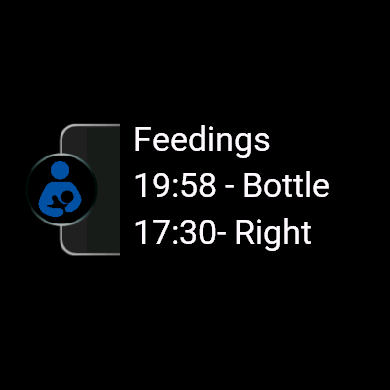

# Breastfeed Tracker for Garmin

A simple breastfeeding tracker for Garmin smartwatches. This app allows you to easily log which breast (left or right) was last used during a feeding session. It includes a Glance view for quick information and supports multiple languages.

|  |  |  |  | 
|:-------------------------------------------------:|:----------------------------------------------:|:------------------------------------------------:|:------------------------------------------------:|
| *Main screen showing the last feeding session.*   | *Glance view for quick information.*            |  *History of the last feedings*                 |*The screen as shown on first start*             |

## Features

- Track breast- or bottlefeeding sessions
- History view
- Undo button
- Glance view with a quick overview off the last 2 feedings
- Available in multiple languages
- Minimalistic interface

## Supported Languages

- English
- Dutch (Nederlands)
- French (Français)
- German (Deutsch)

## Contributing

There are many ways you can help out with the project. Check [CONTRIBUTING.md](CONTRIBUTING.md) to get started.

Thank you :)

## License

This project is licensed under the MIT License. See the [LICENSE](LICENSE) file for details.
